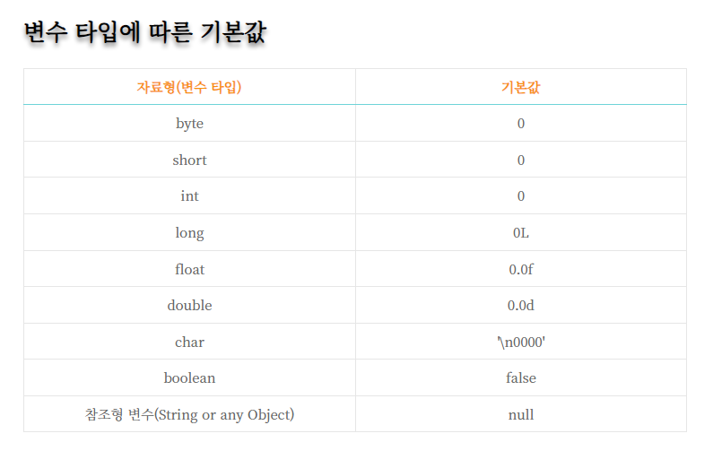
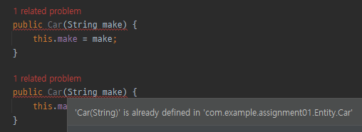
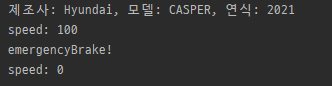

# step2 스프링부트 생성과 간단한 작동원리 이해하기
먼저 해당 브랜치에 자신의 영문 디렉토리를 만들고 가장 상위의 example과 README.md 파일을 자신의 디렉토리에 copy+paste 하여 과제를 진행해주세요
## 실습 과제
아래의 설명을 따라서 적절한 버전과 dependency를 추가하여 spring initializer로 프로젝트를 생성한다.

### 스프링부트 프로젝트 생성하기

Spring Initalizer 링크 (IntelliJ 내에서 생성해도 좋다.)


https://start.spring.io/


#### 이 스터디는 아래와 같은 버전으로 진행한다.

- Spring Boot 3.1.2
- Gradle-Groovy
- Java 17

위와 같은 세팅으로 설정한다. 추후에 추가 가능하니 
스프링부트나 JDK, Java의 경우에는 여러가지 버전이 존재하고 그 사이에서 자유롭게 선택이 가능하다.

#### 차이가 뭘까?

  - 현재로서는 차이를 조사하여도 체감이 되는 부분은 없다.
  - 예로 들면 자바 17부터는 레코드를 지원하기에 이를 이용하지 않을거면 굳이 스프링부트 3.x 버전과 아직 불안정한 스프링 시큐리티 6.x를 사용할 필요가 없으니 스프링부트 2.x와 시큐리티 5.x 버전을 이용하자 라는 생각을 가질수 있다.
  - 실제로 많은 회사에서 아직 3.x로의 버전업을 진행하지 않은 이유도 시큐리티 6.x 의 불안정함 때문이라고 한다.
  - 하지만 이 스터디를 진행하는 인원들은 대부분이 처음 접하는 경우이기 때문에 3.x 버전을 사용하여 취직할 타이밍에 사용할 버전을 준비하는것이 좋을것 같다고 생각이 들어 이렇게 진행하게 되었다.

#### 추가적으로

당연히 MetaData의 Group, Artifact, Name 등은 고쳐주자

### Dependencies

- Lombok ; Entity를 선언하는데 필요한 어노테이션을 통해 자동완성을 해준다.
- Spring Web ; servlet 리스너, 파일 업로딩 IoC 초기화 등 기능과 HTTP 클라이언트와 소통(REST api)에 필요하다.
- Spring Data JPA ; 자바의 객체-관계형 데이터베이스 매핑 기술(ORM)
- Spring Security 
- Validation ; Entity를 선언시에 해당 기능으로 쉽게 객체 필드에 대한 제약조건을 설정할수 있다.
- MySQL Driver ; MySQL DB와 연결하기 위한 드라이버

  
다운로드 후 해당 레포지토리에 스터디 규칙을 지켜서 자신의 영문이름으로 폴더를 만들고 안에 압축 해제를 한다.


## 최종적으로는
#### Generate 후 적절한 JDK 설정과 docker-compose로 만들어진 docker 위의 mySQL과 연결까지 해봅시다!
이전에 example에 있는 assignment01을 실행하여 아래와 같은 결과가 나오는지 확인해봅시다.


*만약 제대로 실행이 되었지만 아래와 같은 오류가 발생한다면 일단은 괜찮습니다. step 3에서 마저 진행하도록 하겠습니다.


## 개념 과제
### 클래스와 객체 그리고 인스턴스의 차이는 무엇인가요?
  - 클래스
    - 객체를 생성하기 위한 일종의 설계도
    - 속성(필드)과 동작(메서드)으로 이루어짐
  - 객체
    - 자신 고유의 속성을 가지는 물리적, 추상적인 모든 대상
  - 인스턴스
    - 클래스를 통해 생성된 객체 하나하나
  - **붕어빵 비유**
    - **붕어빵 틀(클래스)** -> **붕어빵(객체)** -> **붕어빵 하나하나(인스턴스)**
    - 붕어빵을 굽다(인스턴스화 하다)
    - 붕어빵 틀은 '반죽'과 '팥'이라는 변수, '굽다'라는 메소드를 가짐
### 생성자는 왜 사용하나요? 객체를 생성할 때 어떤 역할을 하나요?
  - 생성자는 객체가 생성되는 시점부터 인스턴스(초기값)을 설정하기 위해 사용함
  - 생성자는 어떤 객체가 생성과 동시에 유효함을 보장하는 역할
    1. 유효하지 않은 경우 : Person p는 나이가 0이고 키도 0이다. 이런 사람은 존재할 수 없다.
    ```
    class Person {
    int age;
    int height;
    }
    
    Person p = new Person();
    ```
    2. 유효한 경우
    ```
    class Person {
      int age;
      int height;
      public Person(int age, int height) {
        this.age = age;
        this.height = height;
      }
    }
    Person p = new Person(10, 130);
    ```
### 상속은 어떻게 사용되나요? 왜 중요한 개념인가요?
  - 부모 클래스가 가진 필드와 메소드 그리고 타입을 물려줌 / 자식 클래스는 그것을 받아서 자신의 것처럼 사용할 수 있음
  - 
  - **유전**과 비슷
  - 목적 : 코드의 재사용 -> 유지보수가 쉽고, 중복이 적고, 통일성이 있는 코드
  ```
  //부모 클래스 생성
  class 부모{
	
  }

  //부모 클래스 상속
  class 자식 extends 부모{

  }
  ```
### 접근 제어자의 종류와 각각의 특징은 무엇인가요?
- 접근 제어자
  1. public : 외부 클래스가 자유롭게 사용 가능
  2. protected : 같은 패키지 또는 자식 클래스에서 사용 가능
  3. private : 외부에서 사용 불가능
  4. default : 같은 패키지에 소속된 클래스에서만 사용 가능
- 

### ORM 에 대해서 알아보세요
- Object Relational Mapping
- 프로그래밍 언어의 **객체**와 관계형 데이터베이스의 **데이터**를 **자동으로 매핑**(연결)해주는 도구
- 
- 사용 이유
  - 객체 간의 관계를 바탕으로 SQL을 자동으로 생성하여 불일치를 해결함
- 장점
  - 직관적인 코드 (가독성) + 비지니스 로직 집중 가능 (생산성)
  - 재사용 및 유지보수 편리성 증가

## Example을 보고 실시한다.
### example/생성자와_메서드

```
// 인스턴스 생성
Car myCar = new Car("Hyundai", "G80", 2022);
```
에서 자바의 new 키워드를 이용해 인스턴스를 생성하는 메서드를 호출한다.

그럼 자바는 Car.java로 이동하여 Car 클래스 내부의 클래스명과 같은(Car) 생성자를 이용해 인스턴스를 생성하게 된다.

#### /Car.java
  1. 만약 Car.java에서 생성자를 지우게 된다면 인스턴스는 생성되지 않게 될까요? 생성된다면 왜 생성이 되는걸까요?
   - 기본 생성자에 대해서 알아보세요
     - 생성된다
     - 사용자가 정의한 생성자가 없을 때에는 컴파일러가 기본 생성자를 자동으로 추가하기 때문이다
     - ```Car(){}```
  2. 현재 생성자에서 speed를 0으로 따로 초기화 해주고 있는데 이를 지우게 된다면 어떻게 될까요?
   - 기본 초기화에 대해서 알아보세요
     - 자바에서는 변수를 선언할 경우 초기화를 하지 않더라도 변수의 타입별로 기본값이 존재함
     - 
     - speed를 따로 초기화하지 않는다면, int형이니까 0으로 초기화된다
   - 기본 데이터 타입과 참조 데이터 타입의 차이에 대해서 알아보세요 
     - 기본 데이터 타입
       - byte, char, short, int, long, float, double, boolean
       - 기본 타입으로 선언한 변수는 실제 값을 변수 안에 저장한다.
       - ```int a = 20; boolean flag = false;```

     - 참조 데이터 타입(reference type)
       - 배열 타입, 열거 타입, 클래스, 인터페이스
       - 참조 타입으로 선언된 변수는 메모리의 주소를 값으로 갖는다
       - 주소를 통해 객체를 참조하므로 참조 타입으로 불리는 것이다
       ```
       // str의 값은 객체의 주소 이다. 
       String str = "This is Reference Type";
       ```
  3. 반대로 생성자를 여러개 생성하는 생성자 오버로딩에 대해서 알아보세요
   - 생성자 오버로딩시 주의해야할 점에 대해서 알아보세요 
     - 생성자 오버로딩
       - 생성자의 매개변수의 유형과 개수를 다르게 하여 같은 이름의 생성자를 여러개 가질 수 있다.
     - 조건
       - 매개변수의 개수와 타입이 다르다면 여러 개의 생성자를 선언할 수 있다.
  4. 만약 두 생성자가 매개변수의 개수와 형식이 동일하다면 어떤 오류가 발생할까요? (직접 코드를 작성해보면 좋습니다.)
     - 
     - 
  5. *혹시 가능하다면 생성자 오버로딩을 구현해봅시다!
        ``` 
        // 기본 생성자
            public Car() {
                // TODO: 필드를 기본값으로 초기화
                this.make = null;
                this.model = null;
                this.year = 0;
                this.speed = 0;
            }

            // 매개변수가 3개인 생성자
            public Car(String make, String model, int year) {
                // TODO: make, model, year 초기화, speed는 기본값으로 초기화
                this.make = make;
                this.model = model;
                this.year = year;
                this.speed = 0;
            }

            // 매개변수가 4개인 생성자
            public Car(String make, String model, int year, int speed) {
                // TODO: 모든 필드 초기화   
                this.make = make;
                this.model = model;
                this.year = year;
                this.speed = speed;
            }
        ```

#### /Main.java
  1. 기존에 만든 mycar 인스턴스 대신에 새로운 자동차를 만들어주고 그 자동차의 속도를 100으로 설정해주는 코드를 작성해주세요
      ``` 
      Car jieunCar = new Car("Hyundai", "CASPER", 2021); 
      jieunCar.setSpeed(100);
      ```
  2. 생성자 오버로딩을 구현해보았다면 초기 속도가 100인 자동차의 인스턴스를 만들어보고 emergencyBrake라는 메서드를 만들어 한번에 속도를 0으로 줄이는 메서드를 적용시켜봅시다.
     - ``` 		
       Car jieunCar2 = new Car("Hyundai", "CASPER", 2021, 100);
	   jieunCar2.displayInfo();
       jieunCar2.emergencyBrake();
       ```
     - 

### example/
- 왜 OOP에서는 인스턴스를 만들어 사용할까? 🙊 이유를 정확히 이해하진 못했습니다!
  - OOP : 컴퓨터 프로그램을 명령어의 목록으로 보는 시각에서 벗어나 **"객체"들의 모임**으로 파악하여, 객체 간의 상호작용으로 프로그램의 동작을 구현하는 것
  - 인스턴스를 만들어 사용하는 이유
    - 관심사 분리를 지키면서 유지보수와 재사용성이 용이하기 때문이다
      - 관심사 분리란? 하나의 관심사가 하나의 기능만 수행하도록 코드를 구성하는 것
    - 서로 다른 상태를 가지게 하기 위해서?
- private 멤버에 대한 public 접근자 메서드를 왜 따로 만들어줄까?
  - 정보의 오류를 막을 수 있다
    - public 메서드를 통해 private 멤버에 접근하면서 필요한 유효성 검사나 가공 등을 수행할 수 있다
- private 멤버 변수에 직접 접근할 수 없을 때, 어떻게 값을 읽고 변경할 수 있게될까?
  - Getter와 Setter 메서드를 사용하여 외부에서 읽고 변경할 수 있다.
